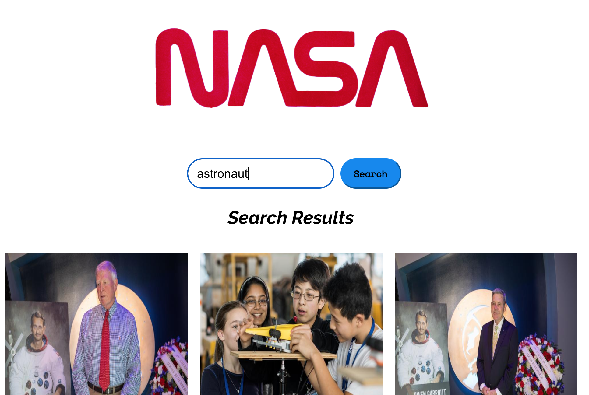

# Nasa Image Search App

This is a React web application that allows users to search for images based on a query related to space. It uses the NASA API endpoint to enable image search.

The project was built as part of Manchester Codes Bootcamp.

# How to Install:

- Clone repo and `cd` into repo
- Run `npm install`
- To start app run `npm start`

# Testing Utilities:

- Jest
- React Testing Library

# Packages:

- Axios
- PropTypes

# Future additions to app:

- Rerouting 'Search Results' page with React Router so that results load on a new page

Author: Maggie du Randt
